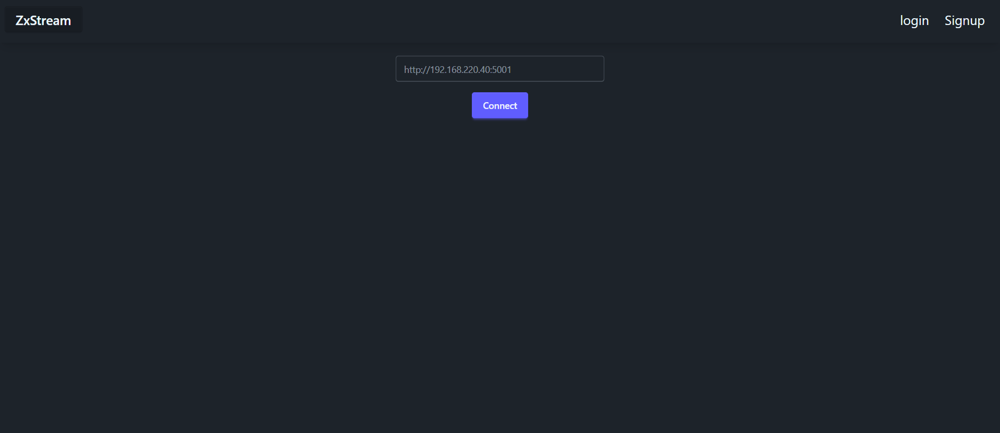
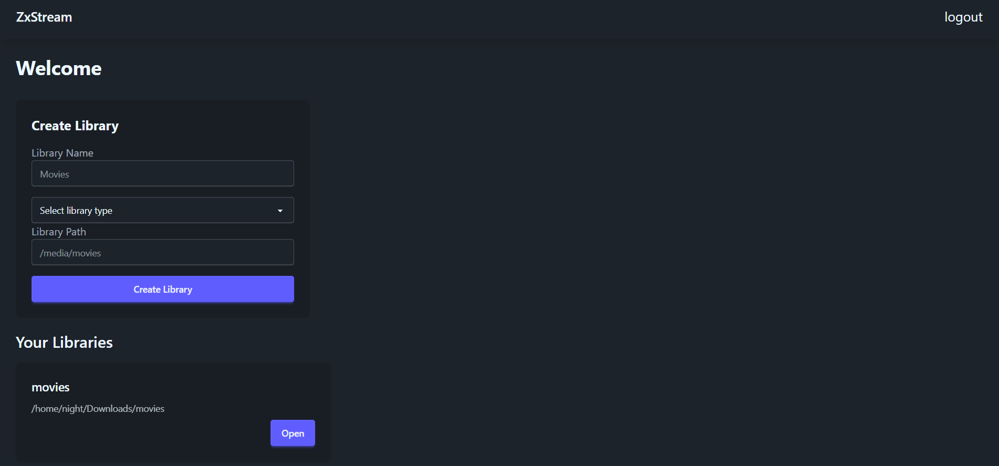
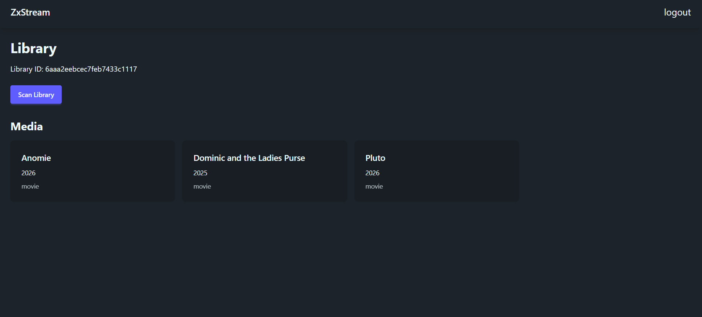

# ZXStream

ZXStream is a self-hosted media server where users can connect their own server and stream their media through web and mobile clients.
**Current Version: `v1.0.0`**

## Screenshots






## Components

ZXStream is divided into three main parts:

### Server

The backend provides the API for:

* User authentication
* Media library management
* Media scanning
* Media metadata
* Video streaming
* Range-based video requests

📖 **Server documentation:** [`server/README.md`](./server/README.md)

### Clients

ZXStream currently has two clients:

1. **Web**
2. **Android**

Each client can connect to the ZXStream server and access the user's media.

### Web Client

📖 **Web documentation:** [`web/README.md`](./clients/web/README.md)

### Android Client

📖 **Android documentation:** [`android/README.md`](./android/README.md)

## Installation

You can install the components you need depending on how you want to use ZXStream.

* For the server setup, refer to [`server/README.md`](./server/README.md)
* For the web client setup, refer to [`web/README.md`](./web/README.md)
* For the Android client setup, refer to [`android/README.md`](./android/README.md)

You can set up the **server and either client**, or use both clients with the same server.

## Project Structure

```text
zxstream/
├── server/
│   ├── README.md
│   └── ...
│
├── web/
│   ├── README.md
│   └── ...
│
├── android/
│   ├── README.md
│   └── ...
│
└── README.md
```

Each component has its own README containing its installation instructions, configuration, and project structure.
